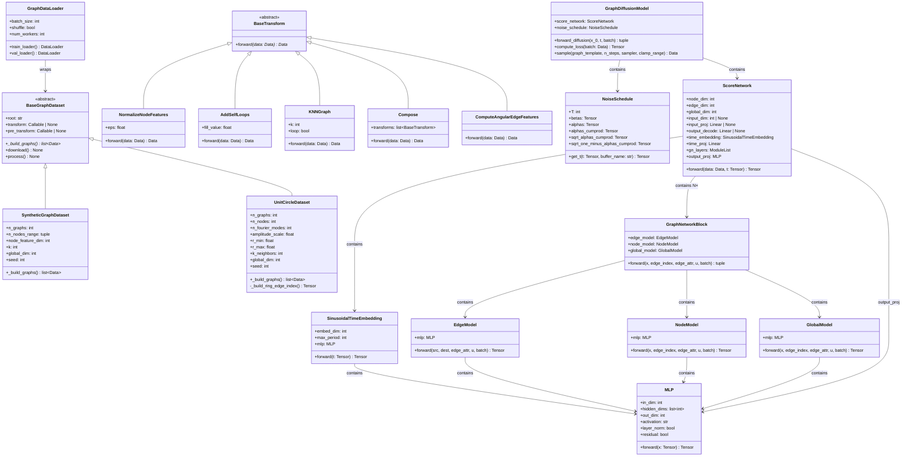
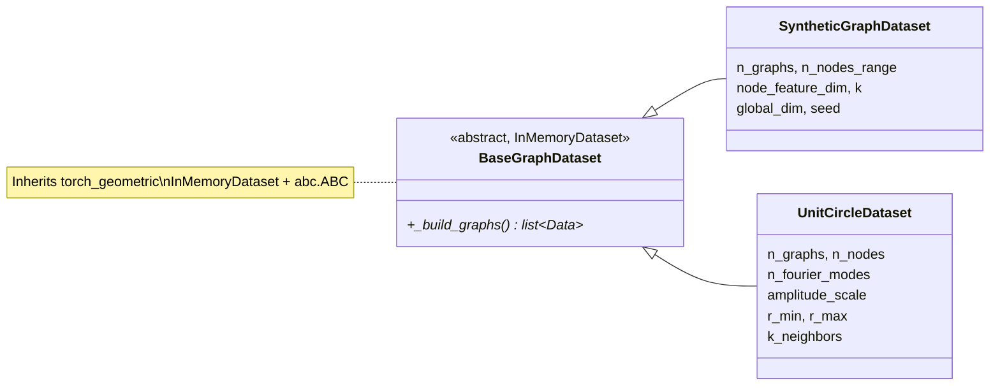
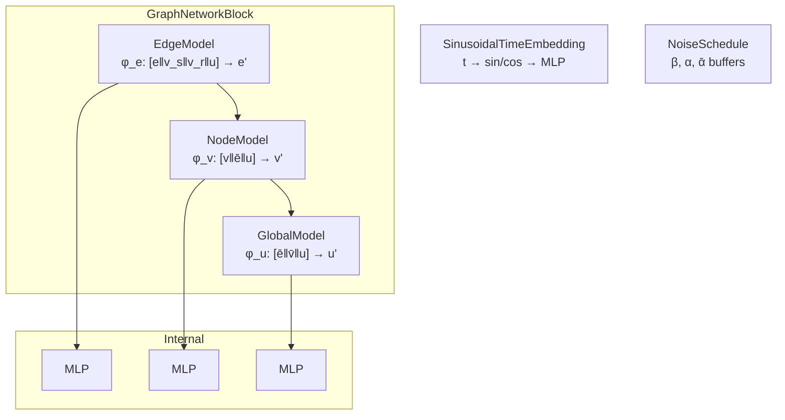
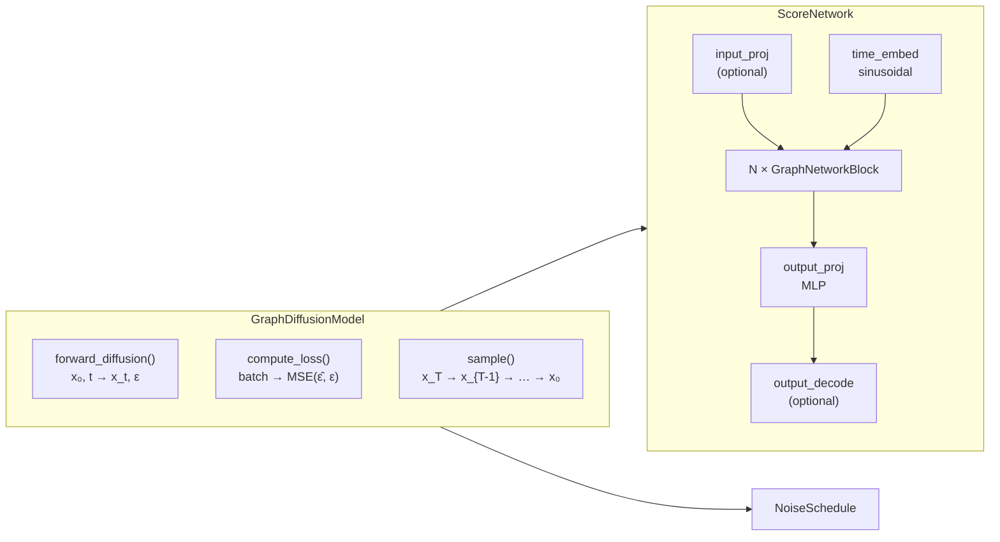
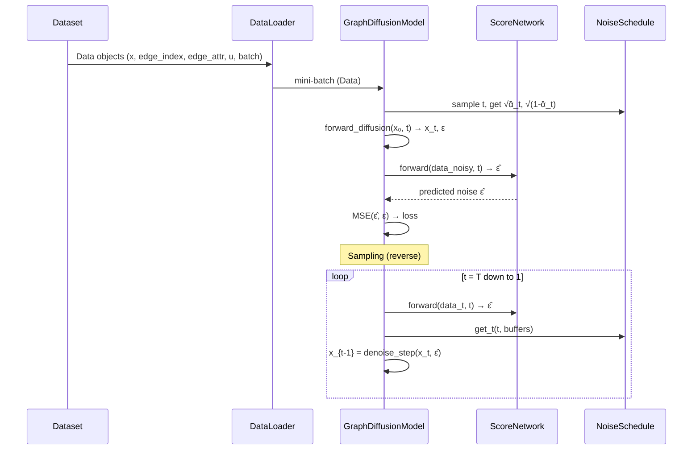

# Architecture Overview

This document describes the full class hierarchy of the `graph_diffusion`
package.  All diagrams use Mermaid and render natively in Obsidian.

> **Vault tip:** Enable the *Mermaid* core plugin in Obsidian settings
> (Settings → Core plugins → toggle on) to render diagrams inline.

---

## Package dependency graph

The three sub-packages form a strict DAG — no circular dependencies allowed.

```mermaid
graph TD
    subgraph graph_diffusion
        data["data/"]
        bb["building_blocks/"]
        model["model/"]
    end

    model -->|imports| bb
    model -.->|"uses at runtime<br/>(Data objects)"| data
    data -.x bb
    data -.x model
    bb -.x data

    style data fill:#4a9eff,stroke:#333,color:#fff
    style bb fill:#ff9f43,stroke:#333,color:#fff
    style model fill:#ee5a24,stroke:#333,color:#fff
```

**Rule:** `data` and `building_blocks` have **no** upstream dependencies.
`model` depends on `building_blocks` only. Data objects (`torch_geometric.data.Data`)
flow through the system without creating import dependencies.

---

## Full class diagram



---

## Sub-package details

### `data/` — datasets & transforms



### `building_blocks/` — reusable components



### `model/` — diffusion pipeline



---

## Data flow



---

## See also

- [[README|Experiment index]] — list of all experiments
- [[changelog|Feature changelog]] — code changes per experiment
- [[EXPERIMENT_PLAN|Experimentation plan]] — planned experiment sequence
