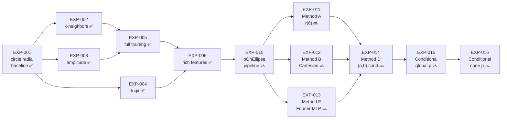

# Experimentation Plan

This document lays out the planned experiment sequence for validating and
extending the `graph_diffusion` framework. The EXP-00x circle series is
**complete**. The EXP-01x series moves to real aerodynamic data.

## Experiment roadmap



---

## Phase 1 — Circle ablations (EXP-002 to EXP-004) ✅ COMPLETE

See [[EXP-00x_series_summary]] for full results and conclusions.

### EXP-002: k-neighbors ablation ✅

Best result: k=6 (val_loss=0.0378, KS=0.0944). Adopted in EXP-005.

### EXP-003: amplitude-scale ablation ✅

Best result: amplitude=0.15 (KS=0.0653, meaningful challenge). Adopted in EXP-005.

### EXP-004: logit-transform bounded diffusion ✅

Result: BVR=0.0 (guaranteed), but KS=0.8929 — not adopted. Clamp heuristic preferred.

---

## Phase 2 — Full training + feature enrichment (EXP-005, EXP-006) ✅ COMPLETE

### EXP-005: full 100-epoch training ✅

Reference result: val_loss=0.0303, KS=0.1049, smoothness=0.0092, BVR=0.0.

### EXP-006: richer node features ✅

Result: marginal smoothness gain (−8%) but 3× higher loss and +24% KS vs EXP-005. Standard DDPM cannot enforce geometric coupling between r, κ, s/L. EXP-005 recipe (single r feature) is the recommended starting point for aerodynamic work.

---

## Phase 3 — Aerodynamic data pipeline (EXP-010) 🔜 ACTIVE

### EXP-010: pOnEllipse dataset ingestion + pressure baseline

| Field | Value |
|-------|-------|
| **Parent** | EXP-005 recipe |
| **Question** | What is the raw h5 structure? Can the DDPM generate realistic pressure fields on ellipse surfaces? |
| **Config** | `configs/EXP-010_ellipse_data_pipeline.yaml` |
| **Blocks** | EXP-011, 012, 013 until five blocking questions answered |

---

## Phase 4 — Shape representation ablation (EXP-011 to EXP-013) 🔜 PLANNED

Three shape representation methods run in parallel once EXP-010 completes.

### EXP-011: Method A — unit ellipse r(θ)

| Field | Value |
|-------|-------|
| **Question** | Does the EXP-005 radial recipe transfer directly to real ellipses? |
| **Config** | `configs/EXP-011_ellipse_shape_method_A.yaml` |

### EXP-012: Method B — Cartesian (x, y) direct

| Field | Value |
|-------|-------|
| **Question** | Does 2D coordinate diffusion outperform polar representation? |
| **Risk** | Rotation ambiguity — verify canonical orientation in EXP-010 |
| **Config** | `configs/EXP-012_ellipse_shape_method_B.yaml` |

### EXP-013: Method E — Fourier coefficient MLP

| Field | Value |
|-------|-------|
| **Question** | Is the GN graph architecture necessary, or does K=16 Fourier coefficient diffusion (MLP) match graph quality? |
| **Config** | `configs/EXP-013_ellipse_shape_method_E.yaml` |

---

## Phase 5 — Conditional inverse design (EXP-014 to EXP-016) 🔜 PLANNED

### EXP-014: Method D — aspect-ratio normalisation

| Field | Value |
|-------|-------|
| **Question** | Does conditioning on (a, b) enable controlled aspect-ratio generation? |
| **Config** | `configs/EXP-014_ellipse_shape_method_D.yaml` |

### EXP-015: Global pressure conditioning

| Field | Value |
|-------|-------|
| **Question** | Can a 4-scalar pressure summary [p_mean, p_std, p_max, p_min] drive shape generation? |
| **Code** | `cond_dim` parameter in `ScoreNetwork`; `cond` passthrough in `GraphDiffusionModel` |
| **Config** | `configs/EXP-015_ellipse_conditional_global.yaml` |

### EXP-016: Node-level pressure conditioning

| Field | Value |
|-------|-------|
| **Question** | Does spatial per-node pressure conditioning outperform global summary (EXP-015)? |
| **Code** | `output_dim` in `ScoreNetwork`; `n_noise_channels` + `p_cond` concat in `GraphDiffusionModel` |
| **Config** | `configs/EXP-016_ellipse_conditional_node.yaml` |

---

## Running experiments on university HPC (SLURM)

### Prerequisites

1. **SSH access** to the HPC cluster
2. **NVIDIA GPU** nodes available via SLURM
3. Python 3.11+ and `uv` installed (or install to `$HOME/.local/bin`)

### First-time setup

```bash
# SSH into the cluster
ssh <username>@<hpc-hostname>

# Clone the repository
git clone <repo-url> ~/Projects/DGN_Simple
cd ~/Projects/DGN_Simple

# Install uv (if not available system-wide)
curl -LsSf https://astral.sh/uv/install.sh | sh
export PATH="$HOME/.local/bin:$PATH"

# Create virtual environment and install dependencies
uv sync

# Verify the installation (on a login node — quick sanity check)
uv run pytest tests/ -x -q --timeout=30
```

### SLURM job script template

Save this as `scripts/run_experiment.slurm`:

```bash
#!/bin/bash
#SBATCH --job-name=graphdiff
#SBATCH --partition=gpu           # adjust to your cluster's GPU partition
#SBATCH --gres=gpu:1              # request 1 GPU
#SBATCH --cpus-per-task=4
#SBATCH --mem=16G
#SBATCH --time=02:00:00           # 2 hours (adjust per experiment)
#SBATCH --output=slurm-%j.out
#SBATCH --error=slurm-%j.err

# ── Load modules (adjust to your cluster) ──
module load python/3.11           # or python/3.12, python/3.13
module load cuda/12.4             # match your PyTorch CUDA version

# ── Activate environment ──
cd ~/Projects/DGN_Simple
source .venv/bin/activate

# ── Run experiment ──
CONFIG="${CONFIG:-configs/circle_radial.yaml}"
EPOCHS="${EPOCHS:-100}"
DEVICE="${DEVICE:-cuda}"
OUTPUT="${OUTPUT:-outputs/${SLURM_JOB_NAME}_${SLURM_JOB_ID}/generated_shapes.png}"

mkdir -p "$(dirname "$OUTPUT")"

python train_circle.py \
    --config "$CONFIG" \
    --epochs "$EPOCHS" \
    --device "$DEVICE" \
    --output "$OUTPUT" \
    2>&1 | tee "outputs/${SLURM_JOB_NAME}_${SLURM_JOB_ID}/train.log"

echo "Job $SLURM_JOB_ID completed at $(date)"
```

### Submitting experiments

```bash
# Single experiment
sbatch --job-name=EXP-010 \
       --export=CONFIG=configs/EXP-010_ellipse_radial_baseline.yaml,EPOCHS=100,DEVICE=cuda \
       scripts/run_experiment.slurm
```

### Monitoring jobs

```bash
squeue -u $USER
tail -f slurm-<job_id>.out
scancel <job_id>
srun --jobid=<job_id> nvidia-smi
```

### Retrieving results

```bash
scp -r <username>@<hpc-hostname>:~/Projects/DGN_Simple/outputs/ ./outputs/
rsync -avz <username>@<hpc-hostname>:~/Projects/DGN_Simple/outputs/ ./outputs/
```

### Tips for university HPC

- **Storage:** Use `$HOME` for code, `$SCRATCH` for large datasets/outputs
- **Modules:** Run `module avail python` and `module avail cuda`
- **Walltime:** Circle experiments ~10 min for 100 epochs on GPU; ellipse experiments may need more
- **Array jobs:** For systematic sweeps, consider SLURM array jobs (`#SBATCH --array=0-3`)
- **Checkpointing:** For longer runs, add periodic `torch.save()` to the training script
