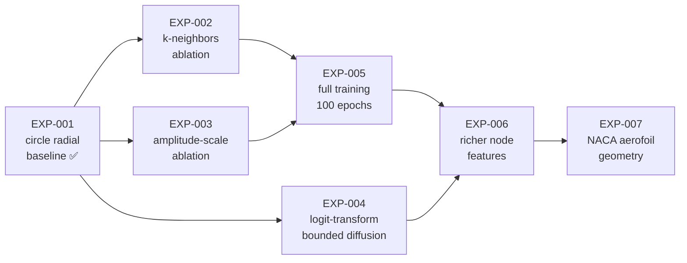

# Experimentation Plan

This document lays out the planned experiment sequence for validating and
extending the `graph_diffusion` framework, starting from the completed
[[EXP-001_circle_radial_baseline]] and building towards aerodynamic shape
generation.

## Experiment roadmap



---

## Phase 1 — Circle ablations (EXP-002 to EXP-004)

These experiments vary one hyperparameter at a time from the EXP-001 baseline
to map the sensitivity landscape.

### EXP-002: k-neighbors ablation

| Field | Value |
|-------|-------|
| **Parent** | [[EXP-001_circle_radial_baseline]] |
| **Question** | Does wider connectivity improve shape smoothness? |
| **Variable** | `k_neighbors` ∈ {1, 2, 4, 6} |
| **Fixed** | All other config identical to EXP-001 |
| **Metrics** | Final loss, visual smoothness, inference time |
| **Config** | `configs/EXP-002_circle_radial_k-neighbors.yaml` (4 runs) |

### EXP-003: amplitude-scale ablation

| Field | Value |
|-------|-------|
| **Parent** | [[EXP-001_circle_radial_baseline]] |
| **Question** | How does perturbation magnitude affect learnability? |
| **Variable** | `amplitude_scale` ∈ {0.05, 0.15, 0.30} |
| **Fixed** | All other config identical to EXP-001 |
| **Metrics** | Final loss, sample diversity, shape fidelity |
| **Config** | `configs/EXP-003_circle_radial_amplitude.yaml` (3 runs) |

### EXP-004: logit-transform bounded diffusion

| Field | Value |
|-------|-------|
| **Parent** | [[EXP-001_circle_radial_baseline]] |
| **Question** | Can logit-transform replace post-hoc clamping for bounded generation? |
| **Change** | Add `logit(r)` / `sigmoid` transforms in forward/reverse diffusion |
| **Metrics** | Loss, boundary violation rate (% samples outside [0.5, 1.5]) |
| **Config** | `configs/EXP-004_circle_radial_logit.yaml` |
| **Code** | New `LogitTransform` class or modifications to `GraphDiffusionModel` |

---

## Phase 2 — Full training + feature enrichment (EXP-005, EXP-006)

### EXP-005: full 100-epoch training

| Field | Value |
|-------|-------|
| **Parent** | Best of EXP-002 / EXP-003 |
| **Question** | What is the converged loss with tuned hyperparameters? |
| **Change** | 100 epochs, lr scheduling (cosine annealing), early stopping |
| **Metrics** | Train/val loss curves, FID-like shape distribution metric |
| **Config** | `configs/EXP-005_circle_radial_full.yaml` |

### EXP-006: richer node features

| Field | Value |
|-------|-------|
| **Parent** | EXP-005 |
| **Question** | Do curvature and arc-length features improve generation quality? |
| **Change** | `input_dim=3` — node features `[r, κ, s/L]` (radius, curvature, normalised arc length) |
| **Code** | Extend `UnitCircleDataset` to compute curvature + arc-length fraction |
| **Config** | `configs/EXP-006_circle_radial_rich-features.yaml` |

---

## Phase 3 — Geometry transfer (EXP-007+)

### EXP-007: NACA aerofoil geometry

| Field | Value |
|-------|-------|
| **Parent** | EXP-006 |
| **Question** | Does the framework generalise to non-circular aerodynamic shapes? |
| **Change** | New `NACADataset` — 2D aerofoil profiles (NACA 4-digit family) |
| **Metrics** | Loss, shape validity (closed curve, no self-intersection), Cl/Cd proxy |
| **Config** | `configs/EXP-007_naca_radial_baseline.yaml` |

---

## Running experiments on university HPC (SLURM)

### Prerequisites

1. **SSH access** to the HPC cluster
2. **NVIDIA GPU** nodes available via SLURM
3. Python 3.11+ and `uv` installed (or install to `$HOME/.local/bin`)

### First-time setup

```bash
# SSH into the cluster
ssh <username>@<hpc-hostname>

# Clone the repository
git clone <repo-url> ~/Projects/DGN_Simple
cd ~/Projects/DGN_Simple

# Install uv (if not available system-wide)
curl -LsSf https://astral.sh/uv/install.sh | sh
export PATH="$HOME/.local/bin:$PATH"

# Create virtual environment and install dependencies
uv sync

# Verify the installation (on a login node — quick sanity check)
uv run pytest tests/ -x -q --timeout=30
```

### SLURM job script template

Save this as `scripts/run_experiment.slurm`:

```bash
#!/bin/bash
#SBATCH --job-name=graphdiff
#SBATCH --partition=gpu           # adjust to your cluster's GPU partition
#SBATCH --gres=gpu:1              # request 1 GPU
#SBATCH --cpus-per-task=4
#SBATCH --mem=16G
#SBATCH --time=02:00:00           # 2 hours (adjust per experiment)
#SBATCH --output=slurm-%j.out
#SBATCH --error=slurm-%j.err

# ── Load modules (adjust to your cluster) ──
module load python/3.11           # or python/3.12, python/3.13
module load cuda/12.4             # match your PyTorch CUDA version

# ── Activate environment ──
cd ~/Projects/DGN_Simple
source .venv/bin/activate

# ── Run experiment ──
# Pass config and experiment-specific args via SLURM environment variables
# or hardcode per experiment
CONFIG="${CONFIG:-configs/circle_radial.yaml}"
EPOCHS="${EPOCHS:-100}"
DEVICE="${DEVICE:-cuda}"
OUTPUT="${OUTPUT:-outputs/${SLURM_JOB_NAME}_${SLURM_JOB_ID}/generated_shapes.png}"

mkdir -p "$(dirname "$OUTPUT")"

python train_circle.py \
    --config "$CONFIG" \
    --epochs "$EPOCHS" \
    --device "$DEVICE" \
    --output "$OUTPUT" \
    2>&1 | tee "outputs/${SLURM_JOB_NAME}_${SLURM_JOB_ID}/train.log"

echo "Job $SLURM_JOB_ID completed at $(date)"
```

### Submitting experiments

```bash
# Single experiment
sbatch --job-name=EXP-001 \
       --export=CONFIG=configs/circle_radial.yaml,EPOCHS=100,DEVICE=cuda \
       scripts/run_experiment.slurm

# Ablation sweep (EXP-002: k-neighbors)
for k in 1 2 4 6; do
    sbatch --job-name=EXP-002-k${k} \
           --export=CONFIG=configs/EXP-002_circle_radial_k-neighbors.yaml,EPOCHS=100,DEVICE=cuda \
           scripts/run_experiment.slurm
done

# Ablation sweep (EXP-003: amplitude)
for amp in 0.05 0.15 0.30; do
    sbatch --job-name=EXP-003-a${amp} \
           --export=CONFIG=configs/EXP-003_circle_radial_amplitude.yaml,EPOCHS=100,DEVICE=cuda \
           scripts/run_experiment.slurm
done
```

### Monitoring jobs

```bash
# Check job status
squeue -u $USER

# Watch output in real time
tail -f slurm-<job_id>.out

# Cancel a job
scancel <job_id>

# Check GPU utilisation on a running job
srun --jobid=<job_id> nvidia-smi
```

### Retrieving results

```bash
# From your local machine — pull results back via scp
scp -r <username>@<hpc-hostname>:~/Projects/DGN_Simple/outputs/ ./outputs/

# Or use rsync for incremental sync
rsync -avz <username>@<hpc-hostname>:~/Projects/DGN_Simple/outputs/ ./outputs/
```

### Tips for university HPC

- **Storage:** Use `$HOME` for code, `$SCRATCH` for large datasets/outputs
  if your cluster provides it — adjust paths in configs accordingly
- **Modules:** Run `module avail python` and `module avail cuda` to see
  available versions on your cluster
- **Walltime:** Circle experiments are fast (~10 min for 100 epochs on GPU).
  Request 2h to be safe; NACA experiments may need more
- **Array jobs:** For systematic sweeps, consider SLURM array jobs
  (`#SBATCH --array=0-3`) with a parameter lookup table
- **Checkpointing:** For longer runs, add periodic `torch.save()` to
  `train_circle.py` so jobs can resume after walltime limits
